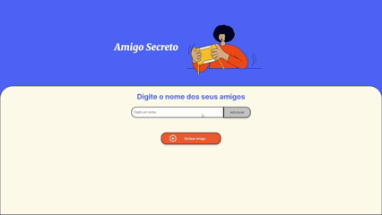

# 🎁 Amigo Secreto

Projeto desenvolvido como parte de um **challenge do programa [Oracle Next Education](https://www.oracle.com/br/education/oracle-next-education/)**.  
O objetivo é criar, em **JavaScript**, a lógica de um sistema simples de **Amigo Secreto**.

## 🚀 Funcionalidades

- Adicionar nomes de participantes a uma lista  
- Exibir a lista de participantes cadastrados  
- Sortear aleatoriamente um nome da lista  
- Garantir um sorteio justo e imprevisível

## 🛠️ Tecnologias utilizadas

- **JavaScript** (lógica principal)  
- **HTML** e **CSS** (interface básica)

## 📂 Estrutura do projeto

```
📦 amigo-secreto
 ┣ 📜 index.html # Estrutura da página
 ┣ 📜 style.css # Estilização da página
 ┣ 📜 app.js # Lógica em JavaScript
 ┗ 📜 README.md # Documentação do projeto
```

## 📸 Demonstração



## 🌐 Acesse o projeto

👉 [Clique aqui para acessar o projeto no GitHub Pages](https://matheusdasilvaoliveira.github.io/amigo-secreto/)

## 🎯 Objetivos do desafio

- Praticar lógica de programação em JavaScript

- Manipular listas e o DOM

- Estruturar um projeto simples e funcional

## 💡 Possíveis melhorias futuras

- Melhorias de estilização

- Melhorias de UI/UX

## ✨ Autor

Matheus da Silva Oliveira

GitHub: [**@matheusdasilvaoliveira**](https://github.com/matheusdasilvaoliveira)
